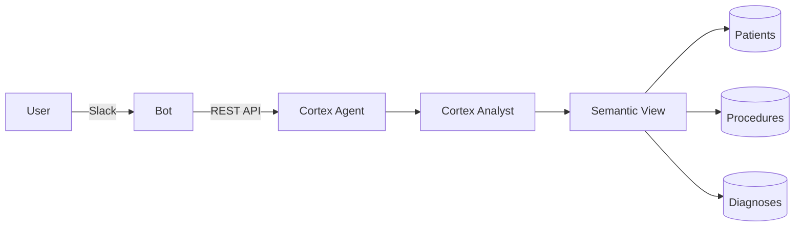

# Cortex Agent Slack Integration

> DEMONSTRATION PROJECT - EXPIRES: 2026-02-22
> This demo uses Snowflake features current as of January 2026.
> After expiration, this repository will be archived and made private.

**Author:** SE Community
**Purpose:** Reference implementation for integrating Snowflake Cortex Agents with Slack
**Created:** 2026-01-23 | **Expires:** 2026-02-22 (30 days) | **Status:** ACTIVE

---

## Minimal Cortex Agent Integration

If you just want the core Cortex Agent + Slack integration without charts or streaming:

```bash
pip install slack-bolt requests python-dotenv
export SLACK_APP_TOKEN=xapp-...
export SLACK_BOT_TOKEN=xoxb-...
export PAT=your_programmatic_access_token
export AGENT_ENDPOINT=https://org-account.snowflakecomputing.com/api/v2/databases/SNOWFLAKE_EXAMPLE/schemas/CORTEX_AGENT_SLACK/agents/medical_assistant:run
python bot/example_cortex_minimal.py
```

See [`bot/example_cortex_minimal.py`](bot/example_cortex_minimal.py) - ~60 lines showing the essential Cortex Agent API integration.

---

## Quick Start (Full Demo)

**Prerequisites:** Snowflake account with Cortex access, Slack workspace with admin access

### 1. Deploy Snowflake Objects (2 min)

```sql
-- Run in Snowsight with ACCOUNTADMIN role
-- Copy contents of deploy_all.sql (at root) and click "Run All"
```

This creates:
- 500 synthetic patient records
- 2,000 medical procedures with costs
- 1,500 diagnoses with ICD codes
- Semantic view for natural language queries
- Cortex Agent configured for medical analytics

### 2. Create Slack App (5 min)

1. Go to [api.slack.com/apps](https://api.slack.com/apps) and create new app
2. Enable **Socket Mode** (Settings > Socket Mode > Enable)
3. Add **Bot Token Scopes**: `app_mentions:read`, `chat:write`, `files:write`, `im:history`, `im:read`, `im:write`
4. Enable **Events**: `app_mention`, `message.im`
5. Install to workspace and copy tokens

### 3. Configure Environment

```bash
cp .env.example .env
# Edit .env with your values
```

### 4. Run

```bash
python3 -m venv .venv && source .venv/bin/activate
pip install -r bot/requirements.txt
python bot/app.py
```

## Features

- **Natural Language Analytics** - Ask questions about medical data in plain English
- **Auto-Visualization** - Automatic chart generation for data responses
- **Verified Query Badges** - Visual indicator when using pre-verified SQL
- **Real-time Thinking Display** - See agent reasoning as it works

## Example Queries

Ask the bot:
- "How many procedures by department?"
- "What is the total revenue by department?"
- "Show me patients by insurance provider"
- "What are the most common diagnoses?"
- "Breakdown of diagnosis severity"
- "Average procedure cost by department"

## Architecture



See [`diagrams/`](diagrams/) for detailed architecture diagrams.

## Configuration

### Environment Variables

| Variable | Description | Example |
|----------|-------------|---------|
| `ACCOUNT` | Snowflake account identifier | `orgname-accountname` |
| `HOST` | Snowflake host | `orgname-accountname.snowflakecomputing.com` |
| `DEMO_USER` | Snowflake username | `your_username` |
| `PAT` | Programmatic Access Token | `pat_...` |
| `AGENT_ENDPOINT` | Cortex Agent API endpoint | See below |
| `SLACK_APP_TOKEN` | Slack app-level token | `xapp-...` |
| `SLACK_BOT_TOKEN` | Slack bot token | `xoxb-...` |

### Agent Endpoint Format

```
https://{org}-{account}.snowflakecomputing.com/api/v2/databases/SNOWFLAKE_EXAMPLE/schemas/CORTEX_AGENT_SLACK/agents/medical_assistant:run
```

### Creating a Programmatic Access Token (PAT)

1. Go to Snowsight > User menu > Profile
2. Select "Programmatic access tokens"
3. Create new token with role: `cortex_agent_slack_role`
4. Copy token to `.env` file

## Cleanup

```sql
-- Run sql/cleanup.sql to remove all demo objects
```

## License

Apache 2.0
