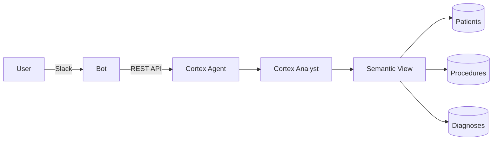

# Cortex Agent Slack Integration

> DEMONSTRATION PROJECT - EXPIRES: 2026-02-22
> This demo uses Snowflake features current as of January 2026.
> After expiration, this repository will be archived and made private.

**Author:** SE Community
**Purpose:** Reference implementation for integrating Snowflake Cortex Agents with Slack
**Created:** 2026-01-23 | **Expires:** 2026-02-22 (30 days) | **Status:** ACTIVE

---

## First Time Here?

Run these in order:

| Step | Action | Location |
|------|--------|----------|
| 1 | Run `deploy_all.sql` (click Run All) | Snowsight |
| 2 | Run `sql/07_setup_authentication.sql` **line-by-line**, copy PAT | Snowsight |
| 3 | Create Slack app, copy tokens | [api.slack.com/apps](https://api.slack.com/apps) |
| 4 | Copy `.env.example` → `.env`, fill in values | Local |
| 5 | `pip install -r bot/requirements.txt && python bot/app.py` | Terminal |

**Prerequisites:** Snowflake account with Cortex access, Slack workspace admin access, Python 3.10+

---

## What Gets Created

| Object | Name | Owner |
|--------|------|-------|
| Database | `SNOWFLAKE_EXAMPLE` | SYSADMIN |
| Schema | `SNOWFLAKE_EXAMPLE.CORTEX_AGENT_SLACK` | SYSADMIN |
| Schema | `SNOWFLAKE_EXAMPLE.SEMANTIC_MODELS` | SYSADMIN |
| Warehouse | `SFE_CORTEX_AGENT_SLACK_WH` | SYSADMIN |
| Role | `cortex_agent_slack_role` | ACCOUNTADMIN |
| Tables | `patients`, `procedures`, `diagnoses` | App Role |
| Semantic View | `SV_CORTEX_AGENT_SLACK_MEDICAL` | App Role |
| Agent | `medical_assistant` | App Role |

Sample data: 500 patients, 2,000 procedures, 1,500 diagnoses

---

## Detailed Steps

### Step 1: Deploy Snowflake Objects

1. Open [Snowsight](https://app.snowflake.com)
2. Open `deploy_all.sql` from repository root
3. Copy entire contents to a new SQL worksheet
4. Click **Run All**

Verify: You should see the agent listed and a sample query result.

### Step 2: Setup PAT Authentication

⚠️ **Run line-by-line** - You must copy the PAT token when displayed!

1. Open `sql/07_setup_authentication.sql`
2. Execute each statement individually (do NOT use Run All)
3. Follow the in-file instructions to create PAT in Snowsight UI
4. **Copy the PAT immediately** - it's shown only once
5. Save PAT for Step 4

### Step 3: Create Slack App

1. Go to [api.slack.com/apps](https://api.slack.com/apps)
2. Click **Create New App** → **From scratch**
3. Name: `Medical Analytics Bot`, select your workspace

**Socket Mode:**
- Settings → Socket Mode → Enable
- Generate app-level token with `connections:write` scope
- Copy the `xapp-...` token

**Bot Permissions** (OAuth & Permissions → Scopes):
- `app_mentions:read`
- `chat:write`
- `files:write`
- `im:history`
- `im:read`
- `im:write`

**Event Subscriptions:**
- Enable Events
- Subscribe to: `app_mention`, `message.im`

**Install:**
- Install to Workspace
- Copy the `xoxb-...` Bot Token

### Step 4: Configure Environment

```bash
cp .env.example .env
```

Edit `.env` with your values:

| Variable | Where to Get It |
|----------|-----------------|
| `ACCOUNT` | Your Snowflake account identifier (e.g., `orgname-accountname`) |
| `HOST` | `{ACCOUNT}.snowflakecomputing.com` |
| `DEMO_USER` | Your Snowflake username |
| `PAT` | From Step 2 (the token you copied) |
| `SLACK_APP_TOKEN` | From Step 3 (`xapp-...`) |
| `SLACK_BOT_TOKEN` | From Step 3 (`xoxb-...`) |

### Step 5: Run

```bash
python3 -m venv .venv && source .venv/bin/activate
pip install -r bot/requirements.txt
python bot/app.py
```

You should see: `⚡️ Bolt app is running!`

---

## Example Queries

Message the bot in Slack:

- "How many procedures by department?"
- "What is the total revenue by department?"
- "Show me patients by insurance provider"
- "What are the most common diagnoses?"
- "Breakdown of diagnosis severity"
- "Average procedure cost by department"

---

## Architecture



See [`diagrams/`](diagrams/) for detailed architecture diagrams.

---

## Understanding the Core

Want to see the minimal integration without charts or streaming?

See [`bot/example_cortex_minimal.py`](bot/example_cortex_minimal.py) - ~60 lines showing the essential Cortex Agent API call:

```bash
pip install slack-bolt requests python-dotenv
python bot/example_cortex_minimal.py
```

This requires the same environment variables from Steps 2-4.

---

## Cleanup

Remove all demo objects:

```sql
-- Run in Snowsight
-- Open sql/99_cleanup.sql and click Run All
```

**Protected (not removed):** `SNOWFLAKE_EXAMPLE` database, `SEMANTIC_MODELS` schema, `GIT_REPOS` schema, `SFE_GIT_API_INTEGRATION`

---

## License

Apache 2.0
