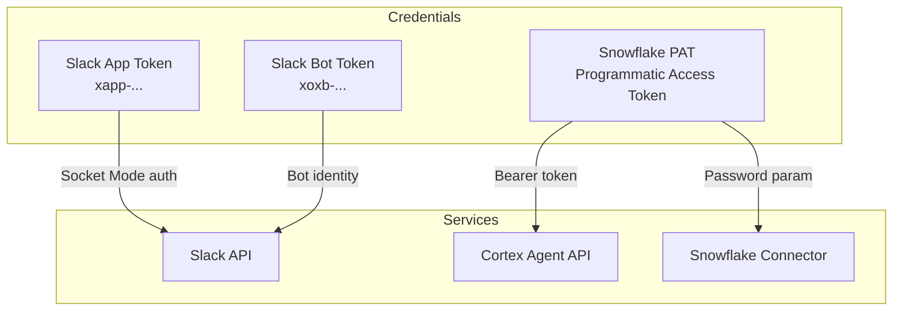
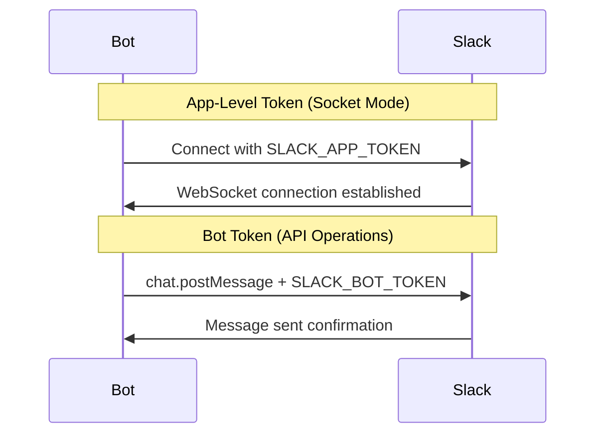
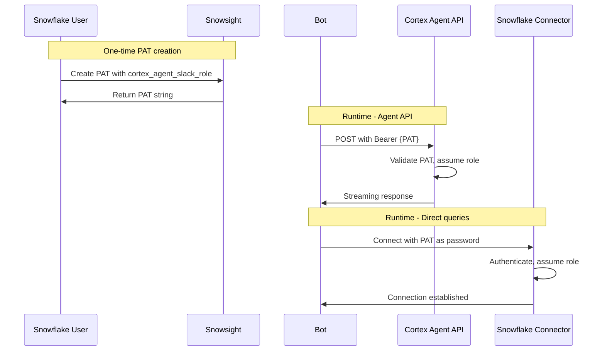
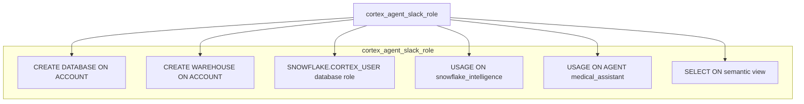

# Authentication Flow

> **Author:** SE Community
> **Project:** Cortex Agent Slack Integration
> **Last Updated:** 2026-01-23

## Authentication Overview

## Slack Authentication

### Token Types

| Token | Purpose | Format | Scopes |
|-------|---------|--------|--------|
| App Token | Socket Mode connection | `xapp-...` | `connections:write` |
| Bot Token | Bot API operations | `xoxb-...` | `app_mentions:read`, `chat:write`, `files:write`, `im:history`, `im:read`, `im:write` |

## Snowflake PAT Authentication

### PAT Configuration

| Property | Value |
|----------|-------|
| Creation Location | Snowsight > User Menu > Profile > Programmatic access tokens |
| Associated Role | `cortex_agent_slack_role` |
| Permissions | Access to agent, semantic view, warehouse |
| Auth Policy | `pat_auth_policy` (NETWORK_POLICY_EVALUATION = ENFORCED_NOT_REQUIRED) |

## Role Permissions

## Security Notes

1. **No secrets in code** - All credentials loaded via `os.getenv()`
2. **PAT rotation** - PATs can be revoked/rotated without code changes
3. **Minimal permissions** - Role has only required grants
4. **Socket Mode** - No public webhook endpoint needed (no inbound firewall rules)
