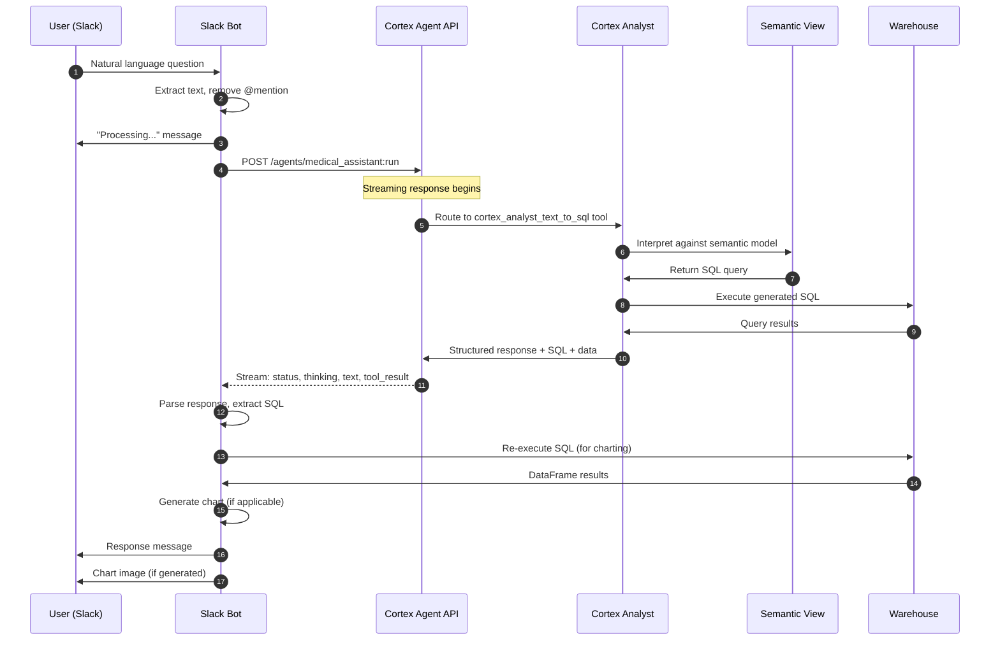
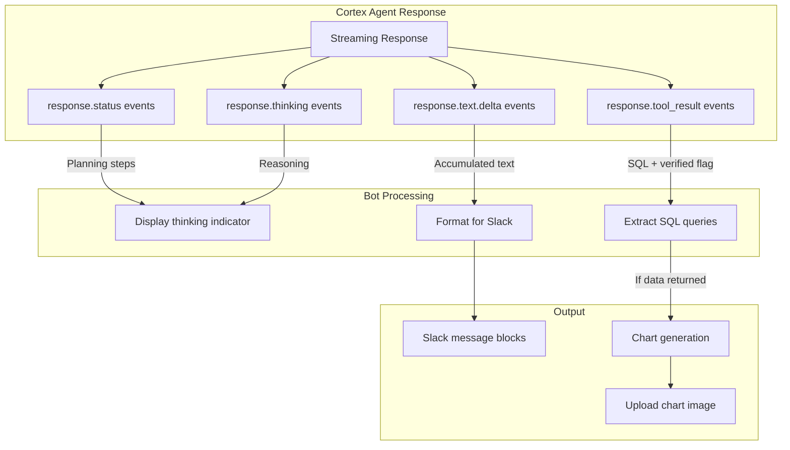

# Data Flow

> **Author:** SE Community
> **Project:** Cortex Agent Slack Integration
> **Last Updated:** 2026-01-23

## Query Processing Flow

## Response Processing

## Data Transformation Points

| Stage | Input | Output | Location |
|-------|-------|--------|----------|
| User Input | Raw Slack message | Cleaned text | `app.py:process_message()` |
| Agent Request | Text query | Streaming HTTP response | `cortex_agent.py:_stream_request()` |
| SQL Extraction | Tool result JSON | SQL string | `cortex_agent.py:_process_tool_result()` |
| Query Execution | SQL string | pandas DataFrame | `cortex_agent.py:_execute_sql()` |
| Chart Generation | DataFrame + question | PNG image path | `charts.py:analyze_and_generate()` |
| Slack Formatting | Response dict | Slack blocks | `app.py:create_response_blocks()` |
