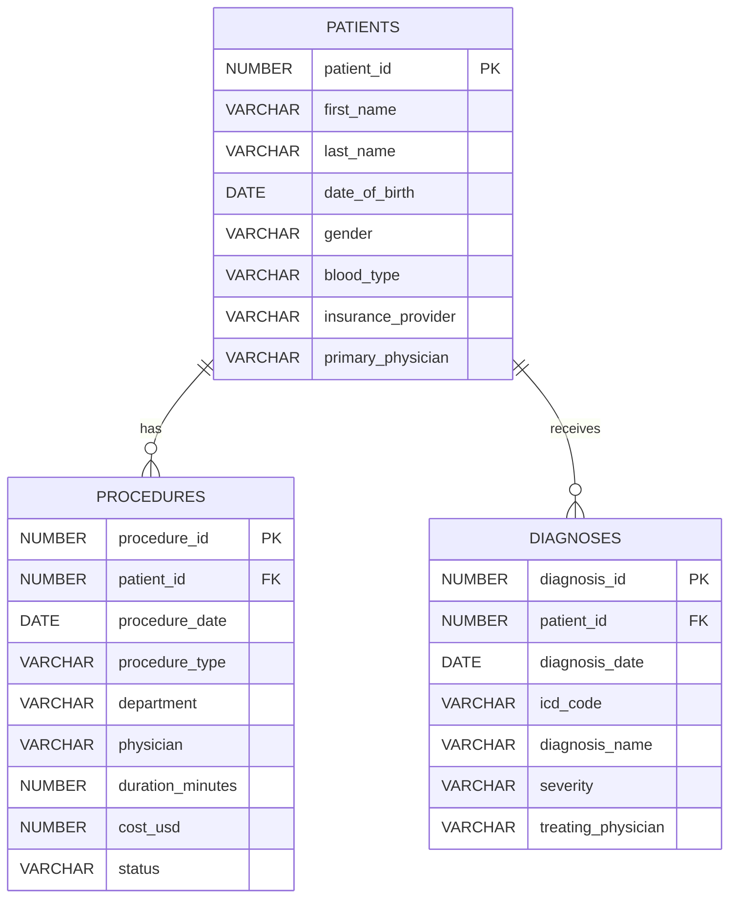
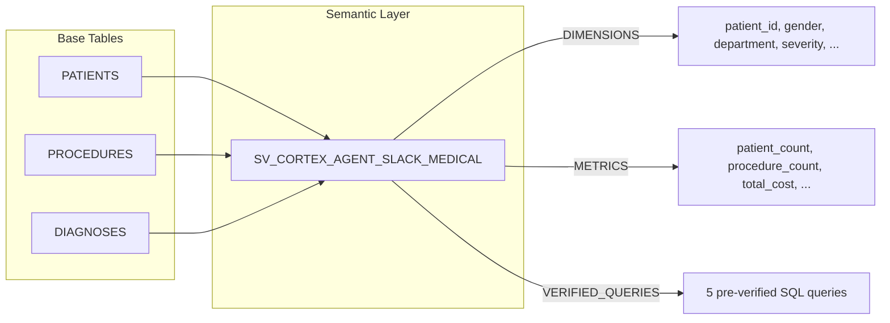

# Data Model

> **Author:** SE Community
> **Project:** Cortex Agent Slack Integration
> **Last Updated:** 2026-01-23

## Entity Relationship Diagram

## Semantic View

The `SV_CORTEX_AGENT_SLACK_MEDICAL` semantic view joins all three tables to provide a unified interface for Cortex Analyst queries.

## Notes

- All tables reside in `SNOWFLAKE_EXAMPLE.CORTEX_AGENT_SLACK` schema
- Semantic view resides in `SNOWFLAKE_EXAMPLE.SEMANTIC_MODELS` schema
- Patient-to-procedure and patient-to-diagnosis relationships are 1:many
- Synthetic data: 500 patients, ~2000 procedures, ~1500 diagnoses
