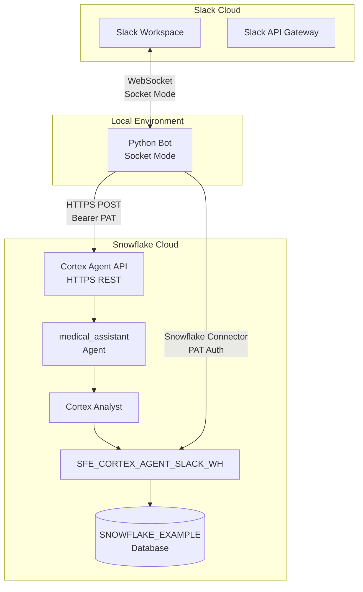
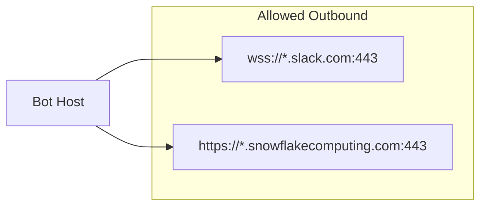

# Network Flow

> **Author:** SE Community
> **Project:** Cortex Agent Slack Integration
> **Last Updated:** 2026-01-23

## Network Topology

## Connection Details

### Slack Connection (Outbound from Bot)

| Property | Value |
|----------|-------|
| Protocol | WebSocket (Socket Mode) |
| Authentication | `SLACK_APP_TOKEN` (xapp-...) |
| Bot Identity | `SLACK_BOT_TOKEN` (xoxb-...) |
| Direction | Bot initiates, bidirectional messages |
| Port | 443 (WSS) |

### Cortex Agent API (Outbound from Bot)

| Property | Value |
|----------|-------|
| Protocol | HTTPS |
| Endpoint | `https://{org}-{account}.snowflakecomputing.com/api/v2/databases/snowflake_intelligence/schemas/agents/agents/medical_assistant:run` |
| Authentication | Programmatic Access Token (PAT) |
| Header | `X-Snowflake-Authorization-Token-Type: PROGRAMMATIC_ACCESS_TOKEN` |
| Port | 443 |

### Snowflake Connector (Outbound from Bot)

| Property | Value |
|----------|-------|
| Protocol | HTTPS |
| Authentication | PAT (via password parameter) |
| Role | `cortex_agent_slack_role` |
| Warehouse | `SFE_CORTEX_AGENT_SLACK_WH` |
| Port | 443 |

## Firewall Requirements

No inbound connections required - Socket Mode eliminates need for public endpoints.
